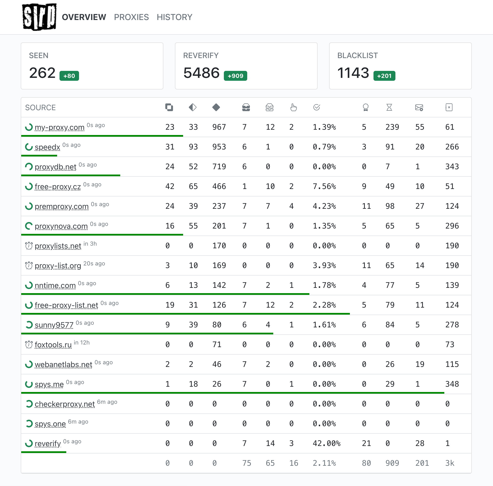
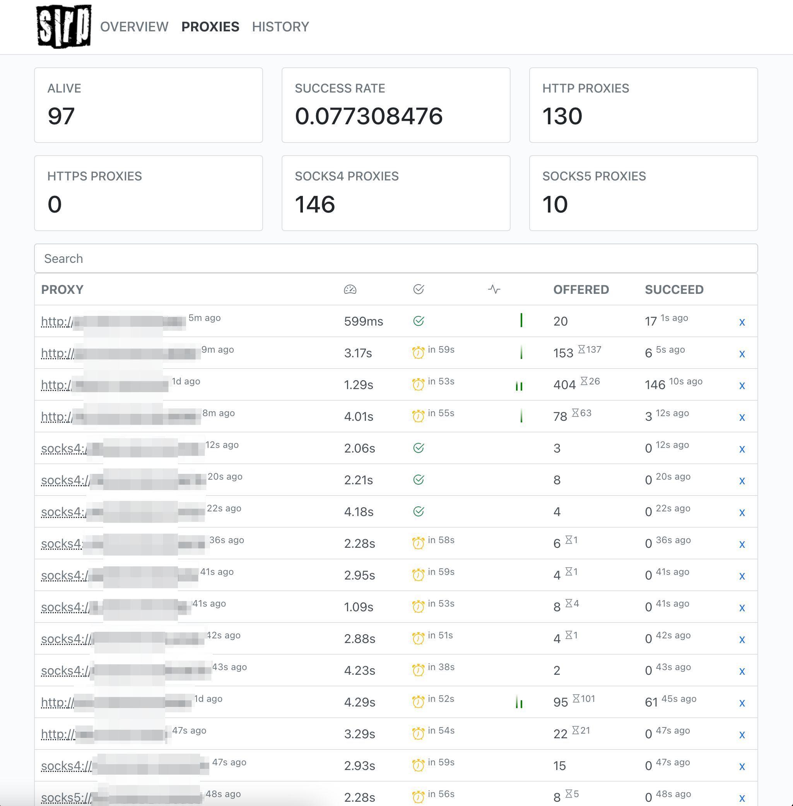
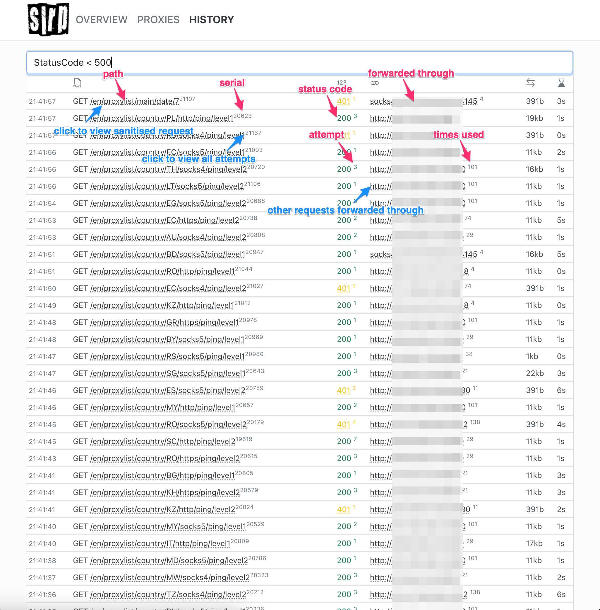

SLRP - rotating open proxy multiplexer
---


[](https://codecov.io/gh/nfx/slrp)

[](https://hanadigital.github.io/grev/?user=nfx&repo=slrp)

* Searches for proxies in open sources
* Intelligently stores state on disk across restarts
* Validates via configurable speed thresholds and anonymity
* Multiplexes HTTP/HTTPS MITM to HTTP, HTTPS, SOCKS4, and SOCKS5
* Exposes REST API for refresh stats and pool health
* Exposes minimal Query Language for filtering of History and Proxy Stats.
* Records request history in-memory for further UI inspection
* Real-time statistics display about available pool
* Packaged as a single executable binary, that also includes Web UI

# Usage
For all methods, wait couple of minutes for the pool to pick up. Check the dashboard at [http://localhost:8089/](http://localhost:8089/) for progress.

## Via binary
Download the binary from the releases, which can be found [here](https://github.com/nfx/slrp/releases)

## Via Docker
> Assuming you have docker and make present
Run `make docker`. Once done, invoke with `docker run -p 8089:8089 -p 8090:8090 -v $HOME/.slrp/data:/data nfx/slrp:latest`

Once running, you can access the UI at [http://localhost:8089/](http://localhost:8089/) and the proxy at [http://localhost:8090/](http://localhost:8090/)
Test using a simple curl command `curl --proxy-insecure -D - -x http:// http://127.0.0.1:8090 -k http://httpbin.org/get` couple of times and see different origins and user agent headers.

# Concepts

* *Source* is an async process that looks at one or more pages for refreshed proxy list. 
* *Refresher* component does best effort on *scheduling* items. 
* Some *sources* perform better forwarded through a *Pool*, warming it up.
* One *proxy* may be seen in multiple *sources*, so we keep *exclusive* proxies per source across refreshes, which are not found in other sources.
* *Proxy* consists of protocol (HTTP, HTTPS, SOCKS4, or SOCKS5) and IP:PORT.
* *Proxy* becomes *Scheduled* immediately after it's seen in the source.
* *Scheduled* could transition into *Probing* queue if it's not *Ignored* (e.g. *Timeouts* or *Blacklist*).
* *Probing* uses configurable pool of rotating anonymity *checkers* to check for liveliness.
* *Timeout* items are re-added to *Scheduled* queue as *Reverify* source to probe item up to 5 times.
* *Blacklist* hosts historical faulty proxies that should never be probed again.
* Successful *check* results in *Found* queue and gets added to a *Pool*.
* *Pool* subdivides its memory into *shards* for randomized rotation and minimal resource contention.
* *Pool* uses configurable and backpressure-controlled workers to perform HTTP request forwarding.
* Every *forwarded request* gets a serial number (returned in `X-Proxy-Serial` header) and picks a different *shard* for an *attempt*, which is reflected in response in `X-Proxy-Attempt` header.
* Every *forwarded request* can later be inspected through `GET /api/history` or UI.
* Every *attempt* picks first available working random proxy from a *shard* and marks it as *Offered*. Total number of offers per used proxy is returned in response in `X-Proxy-Offered` header.
* In the event of no working proxies in a *shard*, *proxy pool exhaustion* errors can do backpressure and slow down issuing of *serial* numbers through simple leaky bucket algorithm.
* Every *succeeded attempt* through a proxy increases it's *Success Rate* (*Succeeded*/*Offered*), which is also calculated per hour. Total number of succeded attempts of used proxy are returned via `X-Proxy-Succeed` header. Proxy used is returned in `X-Proxy-Through` header.
* Every *failed attempt* marks proxy as not working and *suspends offering* it for 5 minutes.

> THE SOFTWARE IS PROVIDED "AS IS", WITHOUT WARRANTY OF ANY KIND, EXPRESS OR IMPLIED, INCLUDING BUT NOT LIMITED TO THE WARRANTIES OF MERCHANTABILITY, FITNESS FOR A PARTICULAR PURPOSE AND NONINFRINGEMENT. IN NO EVENT SHALL THE AUTHORS OR COPYRIGHT HOLDERS BE LIABLE FOR ANY CLAIM, DAMAGES OR OTHER LIABILITY, WHETHER IN AN ACTION OF CONTRACT, TORT OR OTHERWISE, ARISING FROM, OUT OF OR IN CONNECTION WITH THE SOFTWARE OR THE USE OR OTHER DEALINGS IN THE SOFTWARE.

# User Interface

## Overview



[http://localhost:8089/](http://localhost:8089/) shows current source refresh status and stats.

## Proxies



[http://localhost:8089/proxies](http://localhost:8089/proxies) provides search interface over active pool of found proxies. By default, entries are sorted by last working on top. Query samples:

* [`Proxy ~ socks`](http://localhost:8089/proxies?filter=Proxy+%7E+socks) - all SOCKS4 and SOCKS5 proxies
* [`Proxy ~ http`](http://localhost:8089/proxies?filter=Proxy+%7E+http) - all HTTP and HTTPS proxies
* [`Proxy ~ socks AND Succeed > 0`](http://localhost:8089/proxies?filter=Proxy+%7E+socks+AND+Succeed+%3E+0) - all SOCKS proxies that have ever succeeded
* [`Proxy ~ socks AND Succeed > 0 ORDER BY Offered DESC`](http://localhost:8089/proxies?filter=Proxy+%7E+socks+AND+Succeed+%3E+0+ORDER+BY+Offered+DESC) - all SOCKS proxies that have ever succeeded ordered by the number of times attempted
* [`Country:DE OR Country:UK`](http://localhost:8089/proxies?filter=Country%3ADE+OR+Country%3AUK) - proxies from Germany or the United Kingdom
* [`Offered > 0 AND Succeed:0 ORDER BY ReanimateAfter DESC`](http://localhost:8089/proxies?filter=Offered+%3E+0+AND+Succeed%3A0+ORDER+BY+ReanimateAfter+DESC) - candidates for eviction

## History



[http://localhost:8089/history](http://localhost:8089/history) provides search interface over the last 1000 forwarding attempts (configurable). Sample queries:

* [`URL ~ "proxynova.com" AND StatusCode < 400`](http://localhost:8089/history?filter=URL+%7E+%22proxynova.com%22+AND+StatusCode+%3C+400) - all non-failed attempts to URL containing `proxynova.com`.

## Reverify

[http://localhost:8089/reverify](http://localhost:8089/reverify) provides search interface over timed out probes. Sample queries:

* [`Country:CN`](http://localhost:8089/reverify?filter=Country:CN) - all timed out proxies from China

## Blacklist

[http://localhost:8089/blacklist](http://localhost:8089/blacklist) provides search interface over unsuccessful probes. Sample queries:

* [`Failure ~ "this IP address found"`](http://localhost:8089/blacklist?filter=Failure%20~%20%22this%20IP%20address%20found%22) - all transparent proxies.

# Configuration

Conf file is looked in the following paths:

1. `$PWD/slrp.yml`
2. `$PWD/config.yml`
3. `$HOME/.slrp/config.yml`

Default configuration is approximately the following:

```yaml
app:
  state: $HOME/.slrp/data
  sync: 1m
log:
  level: info
  format: pretty
server:
  addr: "localhost:8089"
  read_timeout: 15s
mitm:
  addr: "localhost:8090"
  read_timeout: 15s
  idle_timeout: 15s
  write_timeout: 15s
pprof:
  enable: false
  addr: "localhost:6060"
checker:
  timeout: 5s
  strategy: simple
history:
  limit: 1000
```

Every configuration property can be overridden through environment variable by using `SLRP_` prefix followed by section name and key, divided by `_`. For example, in order to set log level to trace, do `SLRP_LOG_LEVEL=TRACE slrp`.

## app

Fabric that holds application components together.

* `state` - where data persists on disk through restarts of the application. Default is `.slrp/data` of your home directory.
* `sync` - how often data is synchronised to disk, pending availability of any updates of component state. Default is every minute.

## dialer

[WireGuard](https://www.wireguard.com/) userspace VPN dialer configuration. Embeds the official [Go implementation](https://git.zx2c4.com/wireguard-go). Disabled by default.

* `wireguard_config_file` - [configuration file](https://www.wireguard.com/#cryptokey-routing) from WireGuard. IPv6 address parsing is ignored at the moment.
* `wireguard_verbose` - verbose logging mode for WireGuard tunnel.

Sample WireGuard configuration file:

```ini
[Interface]
PrivateKey = gI6EdUSYvn8ugXOt8QQD6Yc+JyiZxIhp3GInSWRfWGE=
Address = 1.2.3.4/24
DNS =  1.2.3.4

[Peer]
PublicKey = HIgo9xNzJMWLKASShiTqIybxZ0U3wGLiUeJ1PKf8ykw=
Endpoint = 1.2.3.4:51820
AllowedIPs = 0.0.0.0/0
```

## log

Structured logging meta-components.

* `level` - log level of application. Default is `info`. Possible values are `trace`, `debug`, `info`, `warn`, and `error`.
* `format` - format of log lines printed. Default is `pretty`, though it's recommended for exploratory use only for performance reasons. Possible values are `pretty`, `json`, and `file` _(experimental)_. `file` will create a `$PWD/slrp.log`, unless specified by `log.file` property.
* `file` _(experimental)_ - application logs in JSON format. Default value is `$PWD/slrp.log`.

## server

API and UI serving component.

* `addr` - address of listening HTTP server. Default is [http://127.0.0.1:8089](http://127.0.0.1:8089).
* `read_timeout` - default is `15s`.
* `enable_profiler` - either or not enabling profiler endpoints. Default is `false`. Developer use only.

## pool

Proxy pool maintenance.

* `request_workers` - number of workers to perform outgoing HTTP requests. Defaults to `512`.
* `request_timeout` - outgoing HTTP request timeout. defaults to `10s`.
* `shards` - number of shards. Defaults to `1`. This property may go away.
* `evict_span_minutes` - number of minutes to identify the latest span of time for rolling counters. Defaults to `5`.
* `short_timeout_sleep` - time to remove a proxy from routing after the first timeout or error.
* `long_timeout_sleep` - time to remove a proxy from routing after `evict_threshold_timeouts` within the last `evict_span_minutes`.
* `evict_threshold_timeouts` - used with `long_timeout_sleep`. Defaults to `3`.
* `evict_threshold_failures` - number of failures within the last `evict_span_minutes` to evict proxy from the pool.
* `evict_threshold_reanimations` - number of any proxy sleeps ever to evict proxy from the pool.

## probe

Proxy probing component.

* `enable_http_rescue` - experimental feature to enable rescuing HTTP proxies, that were presented as SOCKS5 or HTTPS. Detected based on protocol probe heuristics. Defaults to false.

## refresher

Source refresh component.

* `enabled` - run the refresher. Enabled by default.
* `max_scheduled` - number of sources to refresh at the same time. Defaults to 5.

## mitm

HTTP proxy frontend.

* `addr` - address of listening HTTP proxy server. Default is [http://127.0.0.1:8090](http://127.0.0.1:8090).
* `read_timeout` - default is `15s`.
* `idle_timeout` - default is `15s`.
* `write_timeout` - default is `15s`.

## checker

Component for verification of proxy liveliness and anonymity.

* `timeout` - time to wait while performing verificatin. Default is `5s`.
* `strategy` - verification strategy to check the IP of the proxy. Default is `simple`, which will randomly select one of publicly available sites: [ifconfig.me](https://ifconfig.me), [ifconfig.io](https://ifconfig.io), [myexternalip.com](https://myexternalip.com), [ipv4.icanhazip.com/](https://ipv4.icanhazip.com/), [https://ipinfo.io/](ipinfo.io/), [api.ipify.org/](https://api.ipify.org/), or [wtfismyip.com](https://wtfismyip.com). Another strategy is `headers`, which will look for the real IP address in [https://ifconfig.me/all](https://ifconfig.me/all) or [https://ifconfig.io/all.json](https://ifconfig.io/all.json), which might have been added in HTTP headers while forwarding. And there's `twopass` strategy, that will first perform `simple` check and `headers` afterwards.

## history

Component for recording forwarded requests through a pool of proxies.

* `limit` - number of requests to keep in memory. Default is `1000`.

## ipinfo

You can optionally enable this feature. This product includes GeoLite2 Data created by MaxMind, available from https://www.maxmind.com. 

* `license` - your (free) license key for MaxMind downloads. You can skip specifying license key if `mmdb_asn` and `mmdb_city` are already downloaded in any other way and configured.
* `mmdb_asn` - already (or automatically) downloaded snapshots of MaxMind database. Default is `$HOME/.slrp/maxmind/GeoLite2-ASN.mmdb`
* `mmdb_city` - already (or automatically) downloaded snapshots of MaxMind database. Default is `$HOME/.slrp/maxmind/GeoLite2-City.mmdb`

# API

## GET `/api`

Retrieve last sync status for all components

## GET `/api/dashboard`

Get information about refresh status for all sources

## GET `/api/pool`

Get 20 last used proxies

## POST `/api/refresher/{source_name}`

Start refreshing the source

## DELETE `/api/refresher/{source_name}`

Stop refreshing the source

## GET `/api/history`

Get 100 last forwarding attempts

## GET `/api/history/{id}`

Get sanitized HTTP response from forwarding attempt

## GET `/api/reverify`

Get first 20 timed out items that are in the reverify pool

## GET `/api/blacklist`

Get first 20 blacklisted items sorted by proxy along with common error stats

# Developing

UI development requires `npm` installed. Once you have it, please `npm install vite typescript -g`.

# References

* [ProxyBroker](https://github.com/constverum/ProxyBroker) is pretty similar project in nature. Requires couple of Python module dependencies and had the last commit in March 2019. 
* [Scylla](https://github.com/imWildCat/scylla) is pretty similar project in nature. Requires couple of Python module dependencies.
* [ProxyBuilder](https://github.com/jetkai/proxy-builder-2)

## Star History

[](https://star-history.com/#nfx/slrp)

